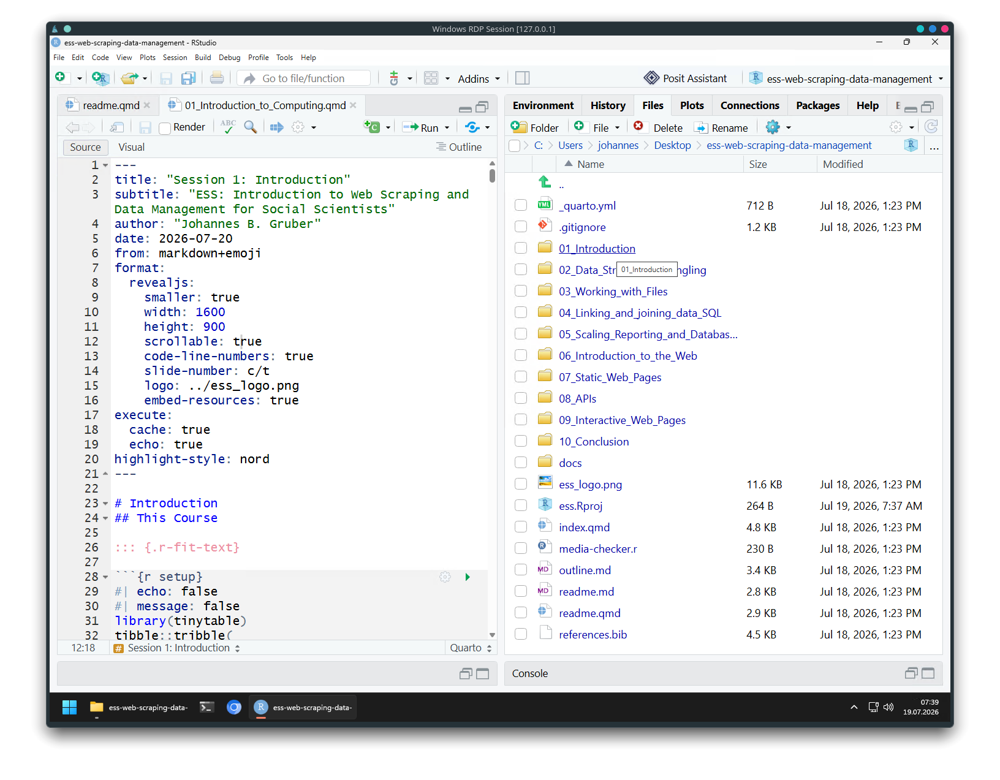
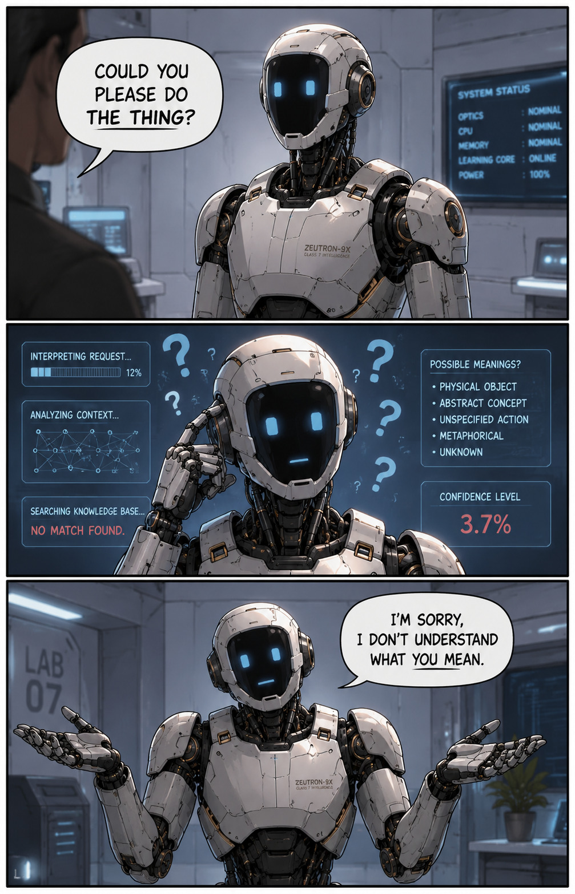
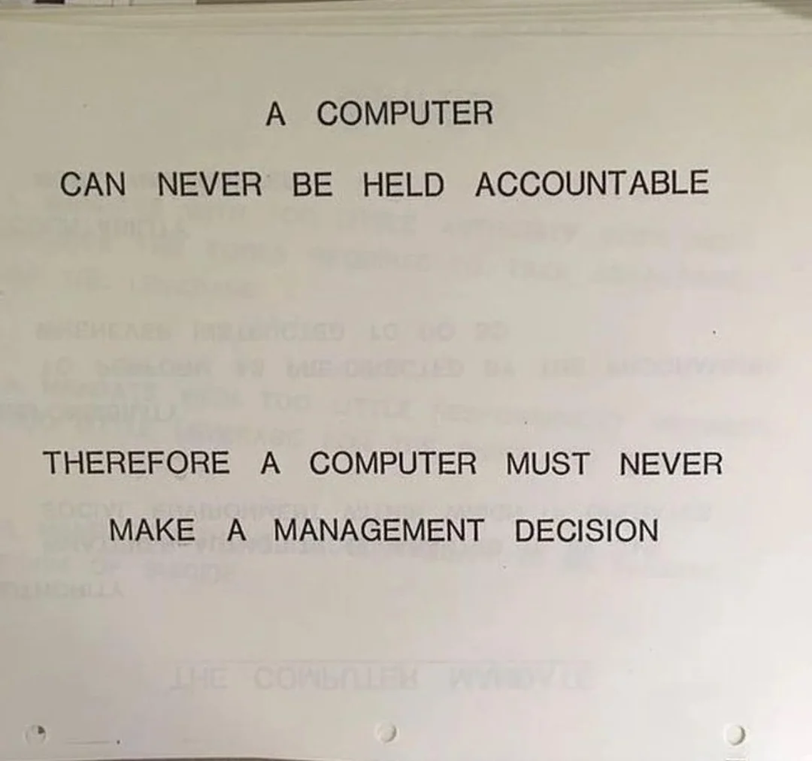
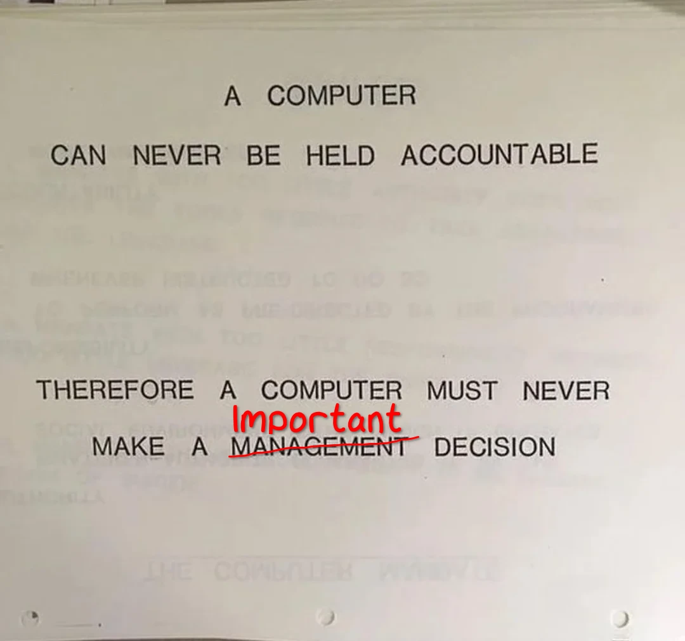
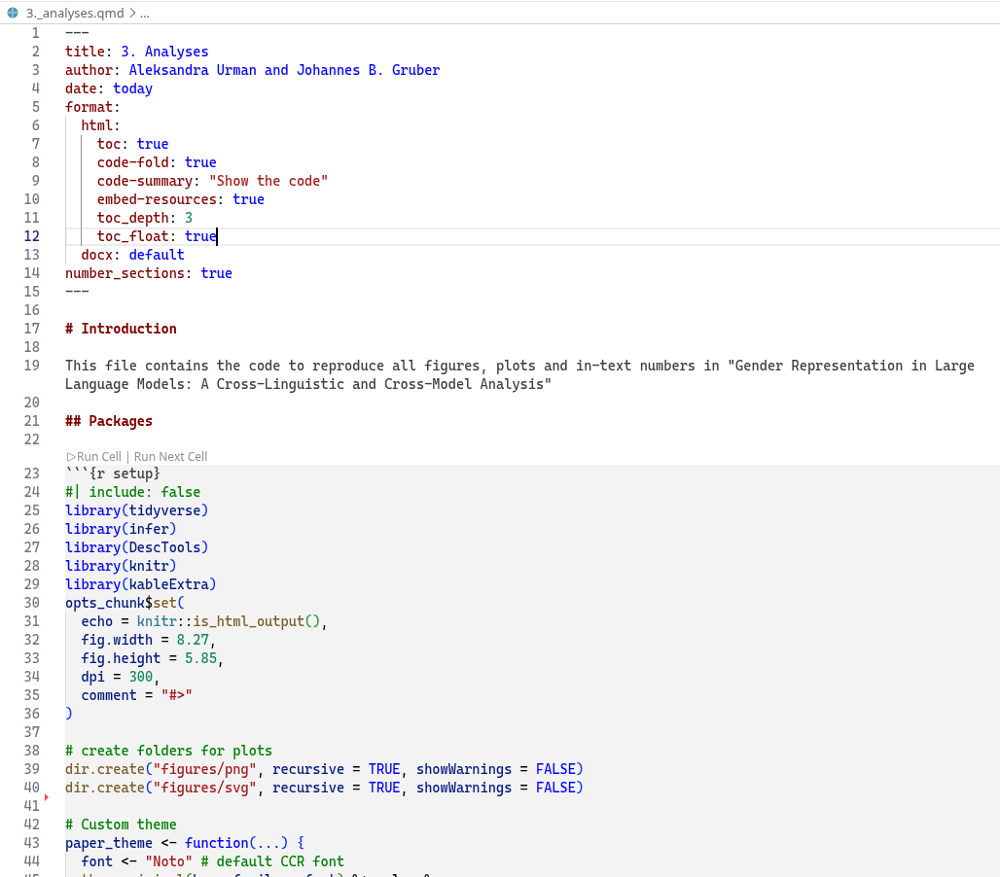

# Introduction
## This Course

::: {.r-fit-text}

```{r setup}
#| echo: false
#| message: false
library(tinytable)
tibble::tribble(
  ~Day , ~Session                                    ,
     1 , "Introduction"                              ,
     2 , "Data Structures and Wrangling"             ,
     3 , "Working with Files"                        ,
     4 , "Linking and joining data & SQL"            ,
     5 , "Scaling, Reporting and Database Software"  ,
     6 , "Introduction to the Web"                   ,
     7 , "Static Web Pages"                          ,
     8 , "Application Programming Interface (APIs) " ,
     9 , "Interactive Web Pages"                     ,
    10 , "Building a Reproducible Research Project"  ,
) |>
  tt() |>
  style_tt(fontsize = 0.6) |>
  style_tt(i = 1, background = "#FDE000")
```

General Goals:

- I want to teach you web scraping and data management
- I also want to give you the tools for *reproducible* and *transparent* open science research
:::

## The Plan for Today

:::: {.columns}

::: {.column width="60%"}
In this session, you learn how to use the **tools** of the hunt.
We will:

- learn about:
  1. each other
  2. the course material and structure
- go over some principles of using the programming language `R`:
  - `R` Refresher
  - literate programming
- wrap up with some useful tools, tips and tricks
:::

::: {.column width="30%" }

[Woody Kelly](https://unsplash.com/@woodkell) via unsplash.com
:::

::::


## Who am I?

:::: {.columns}
::: {.column width="60%"}
- Senior Researcher/Team Lead in Data Services for the Social Sciences @ GESIS
- Previously PostDoc in Communication at VU Amsterdam, University of Amsterdam, and European New School of Digital Studies  
- Interested in:
  - Computational Social Science
  - Open and reproducible science
  - Automated Content Analysis
  - Hybrid Media Systems and Information Flows
  - Protest and Democracy
- Experience:
  - R user since 2015
  - R package developer since 2017
  - Worked on several packages for text analysis, API access and web scraping (spacyr, quanteda.textmodels, LexisNexisTools, paperboy, traktok, rollama, amcat4-r, atrrr, rwhatsapp and more)
:::
::: {.column width="40%"}


Contact: 

- (during the course) [jg23824@essex.ac.uk](mailto:jg23824@essex.ac.uk)
- [johannes.gruber@gesis.org](mailto:johannes.gruber@gesis.org) 
- [\@jbgruber.bsky.social](https://bsky.app/profile/jbgruber.bsky.social)
:::
::::

## Who are you?
:::: {.columns}

::: {.column width="60%"}
- What is your name?
- What are your research interests?
- What is your experience with:
  - R
  - HTML
  - web scraping
  - data management
- Why are you taking this course?
- Do you have specific plans that include webscraping and data management?
- Additional fact (optional)
:::

::: {.column width="40%"}

:::

::::

# Breaks?
##

Total:	14:15	17:45

<!-- This is just some extra CSS code to make the included Markdown tables pretty -->
```{css, include=FALSE}
.reveal .striped tbody tr:nth-child(odd) > * {
  background-color: #FDE000;
}
.reveal .striped tbody tr:nth-child(even) > * {
  background-color: #E6E6E6;
}
```

:::: {.columns .striped}
::: {.column width="33%"}
### Option A

|           |       |       |
|-----------|-------|-------|
| Session 1 | 14:15 | 15:45 |
| Break     | 15:45 | 16:15 |
| Session 2 | 16:15 | 17:45 |
:::
::: {.column width="33%"}
### Option B

|           |       |       |
|-----------|-------|-------|
| Session 1 | 14:15 | 15:15 |
| Break 1   | 15:15 | 15:30 |
| Session 2 | 15:30 | 16:30 |
| Break 2   | 16:30 | 16:45 |
| Session 3 | 16:45 | 17:45 |
:::
::: {.column width="33%"}
### Option C

|           |       |       |
|-----------|-------|-------|
| Session 1 | 14:15 | 15:45 |
| Break 1   | 15:45 | 16:00 |
| Session 2 | 16:00 | 17:30 |
| Break 2   | 17:30 | 17:45 |
:::
::::


# How to use the course material
## Prerequisites

You should have this software installed:

- [R](https://cran.r-project.org/)
- An IDE, preferably [RStudio Desktop](https://posit.co/download/rstudio-desktop/), but you can also use [VSCodium](https://vscodium.com/) or [VS Code](https://code.visualstudio.com/download) or [Positron](https://github.com/posit-dev/positron)
- [Quarto](https://quarto.org/docs/get-started/)

## R version

You need a relatively recent version of R. This command should at least show `R version 4.1.0 (2021-05-18)`:

```{r}
R.Version()$version.string
```

## Get the course material

Navigate here and clone the repository:

<https://github.com/JBGruber/ess-web-scraping-data-management>

In RStudio go to "Create a project" (top left corner with this symbol ).
(If you do not have this symbol, you need to install [Git](https://happygitwithr.com/install-git.html) or [GitHib Desktop](https://docs.github.com/en/desktop/installing-and-authenticating-to-github-desktop/installing-github-desktop) first.)
Then select "Version Control":


Or if you are using the command line, you can simply type:

```bash
git clone https://github.com/JBGruber/ess-web-scraping-data-management.git
# OR
git clone git@github.com:JBGruber/ess-v2-web-scraping-data-management.git
```

## How I will work

I tend to jump back and forth between the slides and RStudio

:::: {.columns}
::: {.column width="50%"}
### Slides


See the rendered slides on: <https://jbgruber.github.io/ess-web-scraping-data-management/>
:::

::: {.column width="50%"}
### Source



See the qmd file in each session folder
:::

::::

## Use the course marerial

1. Pull the latest version at the beginning of each session
2. Make a copy of the qmd file and name it, e.g., "1_Introduction_notes.qmd"
3. Use this file to make notes, for example by adding comments using this syntax `<!-- your comment -->` (RStudio shortcut Ctrl + Shift + C / Command + Shift + C on macOS)
- Alternatively, you can annotate a PDF version of the slides by heading to the [website](https://jbgruber.github.io/ess-web-scraping-data-management/), clicking on the slides you want, then press `e` to export them to PDF (and take notes with PDF reader)

::: {.callout-warning}
This is to make sure you don't get any **git conflicts** when you pull and I updated something in the material in the meantime.
:::

<!-- This is a comment. You can leave them here to take notes linked to the slides. -->

## Your turn (Exercises 1)

1. Download the course material and open the RStudio project or folder in your IDE
2. Open the file `readme.qmd` from the file explorer of your IDE
3. Execute the final code Chunk to install all packages we will need for this course

# Using AI in this course

## Skills {.late-summer}

:::: {.columns}
::: {.column .incremental width="60%"}
- I don't mind if you use AI (Claude (Code), ChaGPT, etc.)
- Just make sure you are still picking up new skills
- E.g., ask the LLM to *explain*, not *write* code (including asking for help if things)
- If the LLM write code, make sure you understand everything it is doing (if you don't see previous bullet)
- Goal: **you know how to recognize/fix critical issues!**
:::
::: {.column width="40%"}

:::
::::

## Access to Information {.fall}

:::: {.columns}
::: {.column .incremental width="50%"}
- Coding agent (like Claude Code) needs to know why+how you want to do something (otherwise 🎲)
- So you need to understand what you are doing
- You need to (be able to) explain to AI what you want and give it the necessary resources
- For example:
  - Give agents access to your project folder ()
  - Put background information (e.g., methods chapter, Readme, Claude.md) in repo


::: {.callout-tip .fragment}
## Beware of context rot!

Long conversations / Many tokens make models become 'dumber'
:::

::: {.callout-caution .fragment}
Note that when using cloud models, the company controlling the API gets this information too!
:::

:::
::: {.column width="38%"}
{height="60%"}
:::
::::

:::{.notes}
- when someone utterly fails at using AI, it is usually because they assume AI know everything
- Models have broad knowledge, not specialised knowledge about your project
:::

## Accountability {.summer}

{.nostretch fig-align="center" width="50%"}

## Accountability {.summer}

{.nostretch fig-align="center" width="50%"}

::: {.absolute  .fragment  width="25%" top="300" right="0"}
::: {.callout-caution}
If AI makes a mistake and you did not catch it, you are getting the bad grade/reputational damage
:::
:::


# `R` refresher
## Packages

- `R` organises its functions in packages (even base functions)
- Most packages must be installed (once) and attached (every new session)

```{r}
#| eval: false
install.packages("tidyverse")
library(tidyverse)
```

## Accessing Functions

If you do not want to attach an entire package, you can use the Double Colon to only use a specific function:

```{r}
dplyr::select(iris, Sepal.Length)
```

Less often used, you can also do this with `library`:

```{r}
#| eval: false
library("dplyr", include.only = c("select", "mutate"))
mutate(iris, sepal_length = Sepal.Length * 10) |>
  select(sepal_length)
```

## The Comprehensive R Archive Network (CRAN)

- Central repository for `R` packages
- Rigorous policies and testing
- Currently more than 24k packages (July 2026)

```{r}
#| echo: false
#| cache: true
library(rvest)
current <- read_html(
  "https://cran.r-project.org/web/packages/available_packages_by_date.html"
) |>
  html_table()

current |>
  purrr::pluck(1) |>
  dplyr::mutate(date = as.Date(Date)) |>
  dplyr::count(date) |>
  dplyr::mutate(n = cumsum(n)) |>
  ggplot2::ggplot(ggplot2::aes(x = date, y = n)) +
  ggplot2::geom_line(linewidth = 2) +
  ggplot2::scale_x_date(
    date_breaks = "2 year",
    date_labels = "%Y",
    limits = as.Date(c("2011-01-01", "2026-01-01"))
  ) +
  ggplot2::labs(
    x = NULL,
    y = NULL,
    title = "Number of R packages on CRAN*",
    caption = "*Archived packages were ignored"
  ) +
  ggplot2::theme_minimal()
```


## Other sources?

- Rigorous policies and testing are also a downside
  - Developers hesitate to submit packages
  - Unmaintained (but functional) packages are removed from CRAN
- Alternative repositories are common:
  - GitHub and Gitlab (and SVN)
  - Bioconductor, R-universe :rocket:, R-Forge and Omegahat

```{r}
#| eval: false
remotes::install_github("JBGruber/paperboy")

# Install package from Bioconductor
BiocManager::install(c("GenomicRanges", "Organism.dplyr"))

# Install 'magick' from 'ropensci' universe
install.packages("magick", repos = "https://ropensci.r-universe.dev")
```

## Help!

One of the most important commands in `R`: `?`/`help`:

```{r}
#| eval: false
?install.packages # And
?remotes::install_github # OR
help("install_github", package = "remotes")
```

:::: {.columns}

::: {.column width="55%"}
All help files in `R` follow the same structure and principle (although not all help files contain all elements):

- **Title**
- **Description**
- **Usage**:very important: shows you the default values for all arguments (i.e., what is used if you do not set anything) and assumed order

```{r}
#| eval: false
install_github("JBGruber/paperboy") # Same as
install_github(repo = "JBGruber/paperboy", ref = "HEAD") # Same as
install_github(ref = "HEAD", repo = "JBGruber/paperboy") # Not(!) same as
install_github("HEAD", "JBGruber/paperboy")
```

- **Arguments**: description of arguments in a function. One special argument is the `...` (called ellipsis or dots) which is passed to underlying function.

```{r}
#| eval: false
install_github("JBGruber/paperboy", Ncpus = 6)
```

- **Details**: Usually not that important but this is the first place to look when a function is not doing what you expect
- **Examples**: where I usually start to learn a new function by looking at cases that certainly work (and then rewriting them for my purposes).
:::

::: {.column width="45%"}

:::

::::


## Help!

- Google ("**ggplot2 r** remove legends")
- Some good resources for answers:
  - stackoverflow.com (if you want to ask a question instead see [how to ask a good question](http://stackoverflow.com/help/how-to-ask) and use a [reproducible example](http://stackoverflow.com/questions/5963269))
  - R help list (stat.ethz.ch) 
  - https://www.r-bloggers.com/ (collection of personal blog posts related to R -- so quality varies)
- Claude/ChatGPT/Gemini/DeepSeek

## Functions

Functions are easy to define in `R`:

```{r}
new_fun <- function(x = 1) {
  out <- c(
    sum(x),
    mean(x),
    median(x)
  )
  return(out)
}
new_fun()
vec <- c(1:10)
new_fun(x = vec)
```

Going through this bit by bit:

- **new_fun**: The name of the new function (convention: use something descriptive; don't use `.` or CamelCase but `_` if you have multiple words)
- **<-**: The assignment operator.
- **function(x)**: Define arguments and defaults here. 
- **{}**: Everything inside the curly brackets is the body of the function (code you are running when calling the function).
- **return()**: All objects created inside the function are immediately destroyed when the function finished running. Except what is put in `return()` (can be implicit).

## Data

In R, data is stored in objects.
We will learn about different ways to do so tomorrow!

## Loops
### For loops

Iterate over a vector:

```{r}
x <- NULL
for (i in 1:10) {
  message(i)
  x <- c(x, i)
}
x
```

- **for**: This is how you start the loop
- **i**: This is the variable which takes a different value in each iteration of the loop
- **in**: separates the variable from the vector
- **1:10**: The vector over which to iterate
- **{}**: The expression inside the round brackets is evaluated once for each value in the vector; `i` takes a different value each run

### Apply loops

Apply function to each element of a vector/list:

```{r}
foo <- function(i, silent = FALSE) {
  if (!silent) {
    message(i)
  }
  return(i)
}
x <- lapply(1:10, foo)
unlist(x)
```

### purrr::map loops

Also apply function to each element of a vector/list, but coerce types:

```{r}
foo <- function(i, silent = FALSE) {
  if (!silent) {
    message(i)
  }
  return(i)
}
x <- purrr::map_int(1:10, foo)
x
```

## if

`if` can be used to conditionally run code:

```{r}
if (TRUE) {
  1 + 1
}
```

```{r}
if (FALSE) {
  1 + 1
}
```

Any code that evaluates to a logical (`TRUE`/`FALSE`) can be used:

```{r}
if (1 + 1 == 2) {
  "Hello!"
}
```

You can extend this with `else`, which is executed when the original condition is `FALSE`:

```{r}
if (1 + 2 == 2) {
  "Hello!"
} else {
  "Bye"
}
```

## base `R`

Commonly people referring to *base* `R` mean all functions available when starting `R` but not loading any packages with `library(package)`.

```{r}
df <- mtcars # using a built-in example data.frame
table(df$cyl)
sum(df$cyl)
mean(df$cyl)
dist(head(df)) # calculates euclidian distance between cases
tolower(row.names(df))
```

Especially for simple operations and statistics, *base* is still great.

```{r}
model <- lm(hp ~ mpg, data = df) # simple linear regression
summary(model)
```

## base `R`

*base* also has a plotting system:

```{r}
plot(
  df$mpg,
  df$hp,
  col = "blue",
  ylab = "horse power",
  xlab = "miles per gallon",
  main = "Simple linear regression"
)
abline(model, col = "red")
text(30, 300, "We can add some text", col = "red")
```

## Tidyverse
### What is it?

- The official description: "The tidyverse is an opinionated collection of R packages designed for data science. All packages share an underlying design philosophy, grammar, and data structures".
- The principle that gives the tidyverse its name is that of tidy data: "Each variable forms a column. Each observation forms a row." (see [tidyr vignette](https://cran.r-project.org/web/packages/tidyr/vignettes/tidy-data.html) for more info)
- Seems trivial at first but as a principle can be quite consequential (e.g., it means that most object types are ignored and `data.frame`s are very dominant)
- Some coding principles attached to it (e.g., the pipe, functions as verbs that build on each other)

### The pipe

- Formerly `%>%`, now native in `R` as `|>`
- Forwards the result of one function to another
- Makes for much more readable code:

```{r}
transform(
  aggregate(. ~ cyl, data = subset(mtcars, hp > 100), FUN = function(x) {
    round(mean(x, 2))
  }),
  kpl = mpg * 0.4251
)
```

You Can make this more readable by createing intermediate objects:

```{r}
data1 <- subset(mtcars, hp > 100) # take subset of original data
data2 <- aggregate(. ~ cyl, data = data1, FUN = function(x) round(mean(x, 2))) # aggregate by taking rounded mean
transform(data2, kpl = mpg * 0.4251) # convert miles per gallon to kilometer per liter
```

Or you use the pipe:

```{r}
subset(mtcars, hp > 100) |>
  aggregate(. ~ cyl, data = _, FUN = function(x) round(mean(x, 2))) |>
  transform(kpl = mpg * 0.4251)
```

`tidyverse` functions are written with pipes in mind and are named as verbs with the goal to tell you exactly what they do:

```{r}
library(tidyverse)
mtcars |>
  filter(hp > 100) |>
  group_by(cyl) |>
  summarise(across(.cols = everything(), .fns = function(x) {
    x |> mean() |> round(2)
  })) |>
  mutate(kpl = mpg * 0.4251)
```

Note: You can interject the `View()` command at any line in a complicated pipeline to see the intermediate result in a spreadsheet-style data viewer.

### Special package `ggplot2`

- Completely overhauls the plotting system in `R`
- IMO: the best plotting system in any programming/data science language
- Implements the "Grammar of Graphics": a language for describing custom plots instead of relying on predefined plotting functions
- The specific logic makes it harder to learn than other packages, but you can express essentially any plots in it (I highly recommend using ["ggplot2: Elegant Graphics for Data Analysis"](https://ggplot2-book.org/) to learn the package instead of individual tutorials)

## Exercises 2

1. Run ggplot(data = mtcars). What do you see and why?
2. In the function `pb_collect()` from `paperboy`, what do the arguments `ignore_fails` and `connections` do?
3. Write a function that takes a numeric vector of miles per gallon consumption data and converts it to kilometer per liter. If anything other than a numeric vector is entered, the function should display an error (hint: see ?stop).
4. In the code below, check the sizes of the intermediate objects with `object.size()`.

```{r}
file_link <- "https://raw.githubusercontent.com/shawn-y-sun/Customer_Analytics_Retail/main/purchase%20data.csv"
df <- read.csv(file_link)
filtered_df <- df[df$Age >= 50, ]
aggregated_df <- aggregate(
  filtered_df$Quantity,
  by = list(filtered_df$Day),
  FUN = sum
)
names(aggregated_df) <- c("day", "total_quantity")
aggregated_df[order(aggregated_df$total_quantity, decreasing = TRUE)[1:5], ]
```

5. How could the code above be improved if you only want the final result, the code should be readable and you care about memory usage?

# Literate Programming
## Background

> “The language in which we express our ideas has a strong influence on our thought processes.”
>
> ― Donald Ervin Knuth, Literate Programming

- When analysing data in R, a cornerstone of a good workflow is documenting what you are doing.
- The whole point of doing data analysis in a programming language rather than a point and click tool is reproducibility.
- Yet if your code does not run after a while and you don't understand what you were doing when writing the code, it's as if you had done your whole analysis in Excel!

## Advantages 

:::: {.columns}

::: {.column .incremental width="30%"}
1. Easier to **understand for yourself**: keep code and explanation together
2. Easier to **find** the code you are looking for: already use the figure and table captions from the article
3. Easier to **write coherent code**: organize code in the way your paper is organized too
4. Easier for your co-authors or **others to understand your scripts**
5. Easier to continue where you left off
6. Easier for others to **reproduce** your analyses
:::

::: {.column width="55%" }

:::

::::


## Exercises 3

1. Use the function `report_template()` from my package [jbgtemplates](https://github.com/JBGruber/jbgtemplates) to start a new report
2. Add some simple analysis in it and render
3. Play around with the [formats](https://quarto.org/docs/output-formats/all-formats.html) and produce at least a PDF and Word output of your document
4. Think about how the structure of the document enhances reproducibility

# Some other tricks
## The worst default setting in RStudio


The default setting to ask whether to save the current session is horrible.
It eventually leads to you clicking yes, save the data and to the creation of a file called `.Rdata`.
This file is loaded whenever you open RStudio!
This makes RStudio slow and can lead to unexpected behaviour, even when you delete all objects in your environment with `rm(list = ls())`.


## Exercises 4

1. Change that setting NOW and look for the `.Rdata` in your project and home directory.


## Git some Version Control

Git is an extensive application and too much to go through.
But you do not need all the functionality to make efficient use of it's main promise: keeping track of what is happening in your projects and giving you the ability to revert to an older state of your project.


This screenshot shows the last months of my PhD, when I was furiously working on integrating comments from different people.
Not only helped git to show me my progress nicely, I also did not have to worry about accidentally deleting anything that might still prove valuable.
Especially towards the end, I often removed sections or copied them to other chapters.
Whenever I could not find a specific section, I went back to the last commit when I could still remember where it was.

Additionally, GitHub offers some nice features to organise and plan projects around *issues*.


Here you can note down remaining problems and keep track of your progress.
It keeps your head free for other things!

Learn more, e.g., at: <https://happygitwithr.com/>

# Homework

Many of you did not come to class to just scrape exercise pages.
You probably had some initial data and/or research question in mind.
Please write a short abstract on what you want to accomplish with the web scraping and data management skills you will learn here.
The abstract should include:

- general goal
- research question
- (preliminary) assessment what data you need, what data can be found on the website and what potential research questions you have in mind.

Deadline: Tuesday midnight


# Wrap Up

Save some information about the session for reproducibility.

```{r}
#| code-fold: true
#| code-summary: "Show Session Info"
sessionInfo()
```
