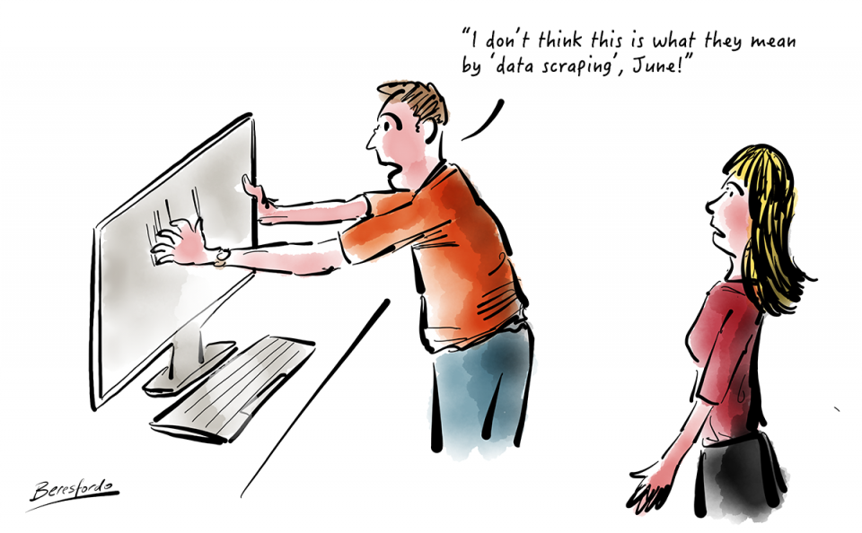
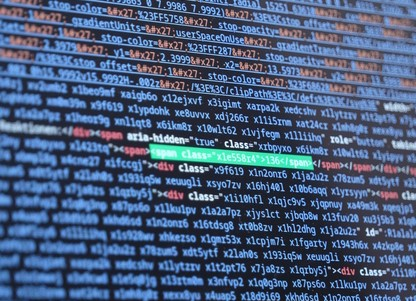
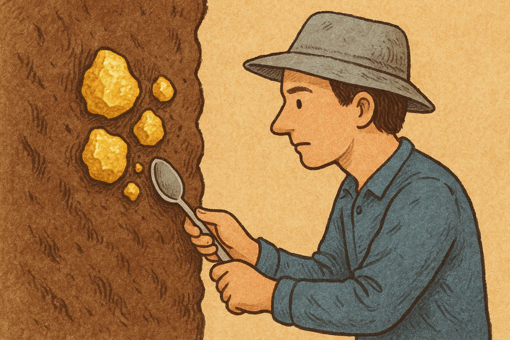
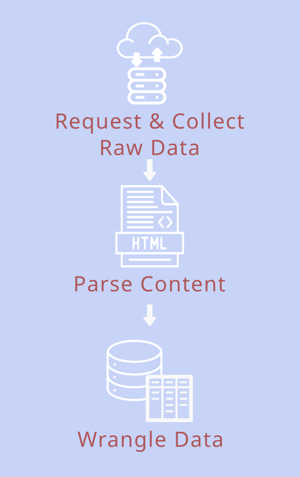
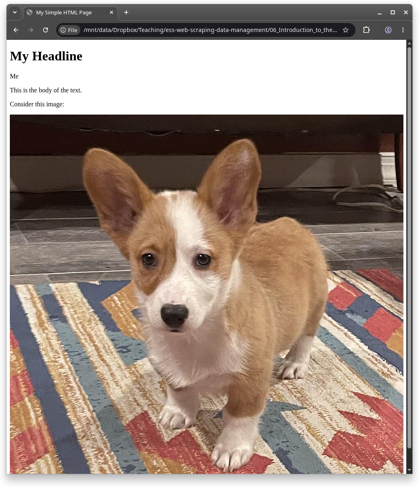
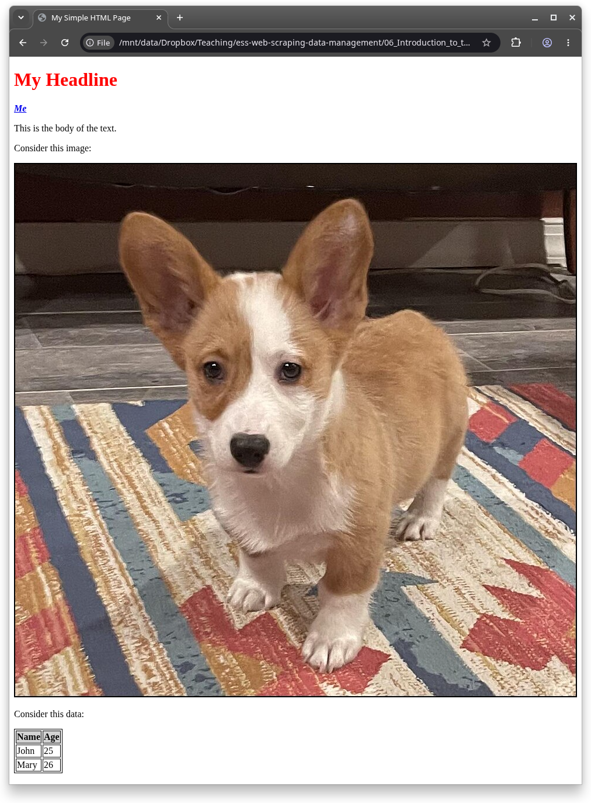

# Introduction
## This Course

<center>
```{r setup}
#| echo: false
#| message: false
library(tinytable)
library(tidyverse)
tibble::tribble(
  ~Day , ~Session                                    ,
     1 , "Introduction"                              ,
     2 , "Data Structures and Wrangling"             ,
     3 , "Working with Files"                        ,
     4 , "Linking and joining data & SQL"            ,
     5 , "Database Software and Scaling your Analyses"  ,
     6 , "Introduction to the Web"                   ,
     7 , "Static Web Pages"                          ,
     8 , "Application Programming Interface (APIs) " ,
     9 , "Interactive Web Pages"                     ,
    10 , "Building a Reproducible Research Project"  ,
) |>
  tt() |>
  style_tt() |>
  style_tt(i = 6, background = "#FDE000")
```
</center>

## The Plan for Today

:::: {.columns}

::: {.column width="60%"}
In this session, we learn how to **scout** data in the wild.
We will:

- discuss web scraping from a theoretical point of view:
  - What is web scraping?
  - Why should you learn it?
- learn a bit more about how the Internet works
  - What is HTML
  - What is CSS
- What legal, ethical, institutional and scientific implications should you keep in mind?
:::

::: {.column width="40%" }

[Angie Gade](https://unsplash.com/@angiefeelstherush) via unsplash.com
:::

::::


# What is Web Scraping
## Forms to get data from the web

:::: {.columns}

::: {.column width="50%"}
- Download data from a website
- Retrieve data via an API
- Scrape the (unstructured) Data

:::{.fragment}

:::
:::

::: {.column width="50%"}


:::
::::


## Web Scraping

:::: {.columns}

::: {.column width="60%" .incremental}
- Used when other means are unavailable
- Scrape the (unstructured) Data from a website
  - E.g: get the author, title, date and body of an online news article
  - E.g: get a table from a website (like Wikipedia)
  - E.g: get all entries from a blog
  - E.g: get all press statements from a political party website
  - E.g: get all hyperlinks to files on a website
- A web-scraper is a program (or robot) that:
  - goes to a web page
  - downloads its content
  - extracts data from the content
  - then saves the data to a file or a database
:::

::: {.column width="40%"}

{width=100%}


:::
::::

## Web Scraping: A Three-Step Process


:::: {.columns}

::: {.column width="60%"}
1. Request & Collect:
    - you send an HTTP request to the webpage
    - server responds to the request by returning HTML content
2. Parse the HTML content
    - extract the information you want from the nested structure of HTML code
3. Wrangle the data into a useful format
    - usually a tidy table
:::
::: {.column width="40%"}

:::
::::

## Hurdles

:::: {.columns}

::: {.column width="50%" .incremental}
- Unfortunately no one-size-fits-all solution
  - Lots of different techniques, tools, tricks
  - Websites change (some more frequently than others)
- Some web pages are easier to scrape than others (by accident or on purpose!):

### Difficulty levels {.fragment}

1. Well behaved static HTML with recurring patterns
2. Haphazard HTML not clearly differentiating between different types of information
3. Interactive web sites loading content by executing code (usually JavaScript or PHP)
4. Interactive web sites with mechanisms against data extraction (rate limits, captchas etc.)
5. Server requests fail without the correct (frequently changing) token
:::

::: {.column width="50%"}
{width=100%}
:::
::::

## Why Should You Learn Web Scraping?

:::: {.columns}

::: {.column width="60%"}
- The internet is a data gold mine!
- Data was not created for research, but are often traces of what people are *actually* doing on the internet
- Reproducible and renewable data collection (e.g., rehydrate data that is copyrighted)
- Web Scraping let's you automate data retrieval (as opposed to using tedious copy & paste on some web site)
- It's one of the most fun tasks to learn R and programming!
  - It's engaging and satisfying to find repeating patterns that you can employ to structure data (every website becomes a little puzzle)
  - It touches on many important computational skills
  - The return is good data to further your career (unlike sudokus or video games)
:::

::: {.column width="40%"}

:::
::::

## Found vs Designed Data

:::: {.columns}

::: {.column width="50%"}
### Designed Data

- Collected for research
- Full control of shape and form
- Problems of validity due to social desirability and imperfect estimation problems
:::

::: {.column width="50%" }
### Found Data

- Traces of human behavior
- Comes in all shapes and forms
- Problems of validity as not representative and incomplete access
:::

::::

# What are HTML and CSS
## What is HTML
- HTML (HyperText Markup Language) is the standard markup language for documents designed to be displayed in a web browser
- Contains the raw data (text, URLs to pictures and videos) plus defines the layout and some of the styling of text


Image Source: [Wikipedia.org](https://en.wikipedia.org/wiki/HTML_element)

## Example: Simple

:::: {.columns}

::: {.column width="50%"}
Code:

```html
<!DOCTYPE html>
<html>
<head>
    <title>My Simple HTML Page</title>
</head>
<body>
    <p>This is the body of the text.</p>
</body>
</html>
```
:::

::: {.column width="50%"}
Browser View:


:::
::::

## Example: With headline and author

:::: {.columns}
::: {.column width="50%"}
Code:

```html
<!DOCTYPE html>
<html>
<head>
    <title>My Simple HTML Page</title>
</head>
<body>
    <h1>My Headline</h1>
    <p class="author" href="https://www.johannesbgruber.eu/">Me</p>
    <p>This is the body of the text.</p>
</body>
</html>
```
:::

::: {.column width="50%"}
Browser View:


:::
::::

## Example: With some data

:::: {.columns}
::: {.column width="50%" height="50%"}
Code:

```{html}
<!DOCTYPE html>
<html>
<head>
    <title>My Simple HTML Page</title>
</head>
<body>
    <h1>My Headline</h1>
    <p class="author">Me</p>
    <p>This is the body of the text.</p>
    <p>Consider this data:</p>
    <table>
        <tr>
            <th>Name</th>
            <th>Age</th>
        </tr>
        <tr>
            <td>John</td>
            <td>25</td>
        </tr>
        <tr>
            <td>Mary</td>
            <td>26</td>
        </tr>
    </table>
</body>
</html>
```
:::

::: {.column width="50%"}
Browser View:


:::
::::

## Example: With an image

:::: {.columns}
::: {.column width="50%"}
Code:

```html
<!DOCTYPE html>
<html>
<head>
    <title>My Simple HTML Page</title>
</head>
<body>
    <h1>My Headline</h1>
    <p class="author">Me</p>
    <p>This is the body of the text.</p>
    <p>Consider this image:</p>
    
</body>
</html>
```
:::

::: {.column width="50%"}
Browser View:


:::
::::

## Example: With a link

:::: {.columns}
::: {.column width="50%"}
Code:

```html
<!DOCTYPE html>
<html>
<head>
    <title>My Simple HTML Page</title>
</head>
<body>
    <h1>My Headline</h1>
    <a href="https://www.johannesbgruber.eu/">
      <p class="author">Me</p>
    </a>
    <p>This is the body of the text.</p>
</body>
</html>
```
:::

::: {.column width="50%"}
Browser View:


:::
::::

## What is CSS

- CSS (Cascading Style Sheets) is very often used in addition to HTML to control the presentation of a document
- Designed to enable the separation of *content* from things concerning the *look*, such as layout, colours, and fonts.
- The reason it is interesting for web scraping is that **certain information often get the same styling**

## Example: CSS

:::: {.columns}
::: {.column width="50%"}
HTML:

```html
<!DOCTYPE html>
<html>
<head>
    <title>My Simple HTML Page</title>
    <link rel="stylesheet" type="text/css" href="example.css">
</head>
<body>
  <h1 class="headline">My Headline</h1>
  <p class="author">Me</p>
  <div class="content">
    <p>This is the body of the text.</p>
    
    <p>Consider this data:</p>
    <table>
      <tr class="top-row">
          <th>Name</th>
          <th>Age</th>
      </tr>
      <tr>
          <td>John</td>
          <td>25</td>
      </tr>
      <tr>
          <td>Mary</td>
          <td>26</td>
      </tr>
    </table>
  </div>
</body>
</body>
</html>

```

CSS:

```css
/* CSS file */

.headline {
  color: red;
}

.author {
  color: grey;
  font-style: italic;
  font-weight: bold;
}

.top-row {
  background-color: lightgrey;
}

.content img {
  border: 2px solid black;
}

table, th, td {
  border: 1px solid black;
}
```
:::

::: {.column width="50%"}
Browser View:


:::
::::

## Exercises 1

1. Add another paragraph to `data/example.html` and display it in your browser
2. Add a second level headline to the page
3. Add another image to the page
4. Manipulate the files `data/example.html` and/or `data/example.css` so that "content" is displayed in italics

# HTMl and CSS in Web Scraping: first steps
## Using HTML tags:

You can select HTML elements by their tags

```{r}
library(rvest)
read_html("data/example.html") |>
  html_elements("p") |>
  html_text2()
```

- to select them, **tags** are written without the `<>`
- in theory, arbitrary tags are possible, but commonly people use `<p>` (paragraph), `<br>` (line break), `<h1>`, `<h2>`, `<h3>`, ... (first, second, third, ... level headline), `<b>` (bold), `<i>` (italic), `` (image), `<a>` (hyperlink), and a couple more.

## Using attributes

You can select elements by an attribute, including the class:

```{r}
read_html("data/example.html") |>
  html_element("[class=\"headline\"]") |>
  html_text()
```

For `class`, there is also a shorthand:

```{r}
read_html("data/example.html") |>
  html_element(".headline") |>
  html_text()
```

Another important shorthand is `#`, which selects the `id` attribute:

```{r}
read_html("data/example.html") |>
  html_element("#table-1") |>
  html_table()

read_html("data/example.html") |>
  html_element("#table-1 > tr")
```

## Extracting attributes

Instead of selecting by attribute, you can also extract one or all attributes:

```{r}
read_html("data/example.html") |>
  html_elements("a") |>
  html_attr("href")
```

```{r}
read_html("data/example.html") |>
  html_elements("a") |>
  html_attrs()
```

## Chaining selectors

If there is more than one element that fits your selector, but you only want one of them, see if you can make your selection more specific by chaining selectors with `>` (for the immediate children) or an empty space (for any children and descendants of an element):

```{r}
read_html("data/example.html") |>
  html_elements(".author>a") |>
  html_attr("href")
```

```{r}
read_html("data/example.html") |>
  html_elements(".author a") |>
  html_attr("href")
```

Tip: there is also no rule against doing this instead:

```{r}
read_html("data/example.html") |>
  html_elements(".author") |>
  html_elements("a") |>
  html_attr("href")
```

## Common Selectors {.smaller}

There are quite a lot of [CSS selectors](https://www.w3schools.com/cssref/css_selectors.asp), but often you can stick to just a few:

| selector        | example           | Selects                                                    |
|-----------------|-------------------|------------------------------------------------------------|
| element/tag     | `table`           | **all** `<table>` elements                                 |
| class           | `.someTable`      | **all** elements with `class="someTable"`                  |
| id              | `#table-1`        | **unique** element with `id="table-1"`                     |
| element.class   | `tr.headerRow`    | **all** `<tr>` elements with the `headerRow` class         |
| class1.class2   | `.someTable.blue` | **all** elements with the `someTable` AND `blue` class     |
| element,element | `tr,p`            | **all** `<tr>` elements AND **all** `<p>` elements         |
| class1 tag      | `.table-1 tr`     | **all** `<tr>` elements that are descendants of `.table-1` |
| class1 > tag    | `.table-1 > tr`   | **all** `<tr>` elements that are direct children of `.table-1` |
| class1 + tag    | `.table-1 + a`    | the `<a>` element directly following an element `.table-1` |
| [attribute]     | `[required]`      | **all** elements with a `required` attribute              |
| [attr=value]    | `[type="text"]`   | **all** elements with `type` attribute equal to "text"    |
| [attr^=value]   | `[class^="btn"]`  | **all** elements with `class` attribute starting with "btn" |
| [attr$=value]   | <code>[src&#36;=".jpg"]</code>   | **all** elements with `src` attribute ending with ".jpg"  |
| [attr*=value]   | `[class*="nav"]`  | **all** elements with `class` attribute containing "nav"  |
| :first-child    | `tr:first-child`  | **all** `<tr>` elements that are the first child of their parent |
| :last-child     | `tr:last-child`   | **all** `<tr>` elements that are the last child of their parent |
| :nth-child(n)   | `tr:nth-child(2)` | **all** `<tr>` elements that are the 2nd child of their parent |

: Common CSS selectors {.striped .hover}

## Family Relations

Each html tag can contain other tags.
To keep track of the relations we speak of ancestors, descendants, parents, children and siblings.

```{html}
#| linecode-line-numbers: true
#| code-line-numbers: "1-26|2-14|3-10"
<book>
  <chapter>
    <section>
      <subsection>
        This is a subsection.
      </subsection>
      <subsection>
        This is another subsection.
      </subsection>
    </section>
    <section>
      This is a section.
    </section>
  </chapter>
  <chapter>
    <section>
      This is a section.
    </section>
    <section>
      This is a section.
    </section>
  </chapter>
  <chapter>
    This is a chapter without sections.
  </chapter>
</book>
```


## Exercises 2

1. Practice finding the right selector with the CSS Diner game (level 1-16 and 27-32): <https://flukeout.github.io/>
2. Consider the toy HTML example below. Which selectors do you need to put into `html_elements()` (which extracts all elements matching the selector) to extract the information


```{r}
#| eval: false
library(rvest)
webpage <- "<html>
<body>
  <h1>Computational Research in the Post-API Age</h1>
  <div class='author'>Deen Freelon</div>
  <div>Keywords:
    <ul>
      <li>API</li>
      <li>computational</li>
      <li>Facebook</li>
    </ul>
  </div>
  <div class='text'>
    <p>Three pieces of advice on whether and how to scrape from Dan Freelon</p>
  </div>
  
  <ol class='advice'>
    <li id='one'> use authorized methods whenever possible </li>
    <li id='two'> do not confuse terms of service compliance with data protection </li>
    <li id='three'> understand the risks of violating terms of service </li>
  </ol>

</body>
</html>" |>
  read_html()
```

```{r}
#| eval: false
# the headline
headline <- html_elements(webpage, "")
headline
# the author
author <- html_elements(webpage, "")
author
# the ordered list
ordered_list <- html_elements(webpage, "")
ordered_list
# all bullet points
bullet_points <- html_elements(webpage, "")
bullet_points
# bullet points in unordered list
bullet_points_unordered <- html_elements(webpage, "")
bullet_points_unordered
# elements in ordered list
bullet_points_ordered <- html_elements(webpage, "")
bullet_points_ordered
# third bullet point in ordered list
bullet_point_three_ordered <- html_elements(webpage, "")
bullet_point_three_ordered
```

# Implications of Web Scraping
## Four Sets of Considerations

Before starting a scraping project, @brownwebscraping2025 suggest working through four sets of questions:

::: {.incremental}
- **Legal**: what am I *allowed* to access, collect, store and share?
- **Ethical**: what *should* I access, collect, store and share?
- **Institutional**: who do I need to talk to -- and who has my back if something goes wrong?
- **Scientific**: is the data I end up with good enough to answer my question?
:::

::: {.fragment}
The legal and institutional answers are jurisdiction-specific (Brown et al. write for a US audience, we mostly look at the EU).
The ethical and scientific ones travel everywhere.
:::

## Legal: Copyright

Web Scraping is not a shady or illegal activity, **but** not all web scraping is unproblematic and the **data** does not become **yours**.

::: {.incremental}
- Copyright protects **original works of authorship** -- not facts and not raw data
  - but an original selection, arrangement or presentation of data can be protected
- **Accessing** a work is not an infringement, **copying and (re)distributing** protected parts of it can be
- Public facing content is probably okay to *collect* ([9th circuit ruling](https://www.vice.com/en/article/9kek83/linkedin-data-scraping-lawsuit-shot-down))^[that ruling was about *hacking* law -- it did not shield the scraper from other claims about redistribution and using it for commercial gain.]
- "research organisations and cultural heritage institutions" can collect copyrighted data through "text and data mining" if "they they have lawful access" it [Digital Single Market Directive Article 3](https://eur-lex.europa.eu/eli/dir/2019/790/oj)
- The US equivalent question is **fair use**: (1) the purpose (scholarly/non-commercial helps), (2) the nature of the work, (3) how much of it you use, and (4) the effect on the market for the original
- You access most public data for research -- but you will probably get in **trouble if you distribute the material!**
- "there have been no lawsuits in [...] major western democratic countries stemming from a researcher scraping publicly accessible data from a website for personal or academic use." [@luscombewebscraping2022]
:::

## Legal: Personal Data

Collecting **personal data** of people in the EU might violate GDPR (General Data Protection Regulation)

::: {.incremental}
- The GDPR defines personal data as "any information relating to an identified or identifiable natural person." (Art. 4 [GDPR](https://gdpr-info.eu/art-4-gdpr/))
- It applies if you are **based in the EU** *or* if you "monitor the behaviour" of people in the EU (Art. 3) -- so it reaches researchers outside Europe as well
- You need a **legal basis** (Art. 6 [GDPR](https://gdpr-info.eu/art-6-gdpr/)):
  - **legitimate interests** (Art. 6(1)(f)): the usual route for academic scraping -- the benefit of your research has to outweigh the risks for the people in the data
  - **public interest task**: processing is legitimate when "necessary for the performance of a task carried out in the public interest" (Art. 6(1)(e))
  - **consent** from the people whose data it is -- the cleanest option, but almost never feasible at scale
- **Special categories** of data (Art. 9) -- health, sexuality, religion, ethnicity, political opinions -- get extra protection, though scientific research is privileged if the safeguards of Art. 89(1) are in place
:::

## Legal: Personal Data (continued)

Research *is* privileged under the GDPR -- but the privileges come with homework [@brownwebscraping2025]

::: {.incremental}
- You usually do **not** have to inform every single person whose data you scraped, if that would take "disproportionate effort" or undermine the research aims (Art. 14(5)(b))
- Data subject rights can be limited where they would make the research impossible -- e.g., where opt-outs would systematically skew the results (Art. 89)
- **But** the burden of proof is on you: you have to be able to show *appropriate technical and organisational measures*
  - **Data minimisation**: only collect the fields you actually need
  - **Pseudonymisation**: strip or hash identifiers as early in the pipeline as you can
  - **Security**: encrypted, access-controlled storage -- not a folder in your Dropbox
  - **A deletion plan**: when does the raw data go away?
- For larger projects, a **Data Protection Impact Assessment** ([Article 35 of the GDPR](https://gdpr.eu/article-35-impact-assessment/), see also [this template](https://gdpr.eu/data-protection-impact-assessment-template/)) is a good way to write all of this down (and your data protection officer will ask for it anyway)
:::

## Legal: Terms of Service

Terms of Service are **contracts, not laws** -- a clause forbidding scraping does not by itself make scraping illegal.

::: {.incremental}
- To win a breach-of-contract claim, a website operator has to show three things [@brownwebscraping2025]:
  1. there was a **valid agreement**
  2. you **violated** its terms
  3. the violation caused **harm**
- Not all agreements bind you equally:
  - **Browsewrap** ("by using this site you agree...") -- courts have become increasingly reluctant to enforce these
  - **Clickwrap** (you actively ticked "I agree") -- usually enforceable
  - **Sign-in-wrap** (you agreed by creating an account or logging in) -- somewhere in between
- Consequence: scraping publicly accessible pages **while logged out** is a very different situation from scraping from behind a login
- **Harm** is hard to show against non-commercial research -- courts have found no harm where a non-profit scraped public data for advocacy purposes
- But "hard to sue" is not "no consequences": you can still be rate-limited, IP-blocked, sent a cease-and-desist letter, or have your account terminated

:::

## Legal: Hacking Laws

::: {.incremental}
- The US **Computer Fraud and Abuse Act** (CFAA) is the law companies reach for when they want scraping stopped
  - violating a website's terms of service **alone** is not "unauthorised access" ([Sandvig v. Barr, 2020](https://www.aclu.org/cases/sandvig-v-barr-challenge-cfaa-prohibition-uncovering-racial-discrimination-online))
  - **breaking technical controls** can be: bypassing a login, evading IP blocks, or carrying on after a cease-and-desist letter
- The rule of thumb generalises well beyond the US -- **the more a site does to keep you out, the riskier it is to get in**:
  - freely accessible page, no account needed → low risk
  - account needed → grey zone
  - technical barrier you had to defeat → high risk
:::

## Legal: Data Access Rights

Sometimes the law is on your side: the EU **Digital Services Act** (DSA) creates data access *rights* for researchers.^[Small write-up with sources: <https://textplus.hypotheses.org/15885>]

::: {.incremental}
- [DSA Article 40(12)](https://www.eu-digital-services-act.com/Digital_Services_Act_Article_40.html): [Very Large Online Platforms/Search Engines](https://digital-strategy.ec.europa.eu/en/policies/list-designated-vlops-and-vloses) (VLOPs/VLOSEs) must give access to data that is **publicly accessible** in their interface
  - requested **directly from the platform**, no regulator involved
  - open to researchers affiliated with not-for-profit bodies as well, not just universities
  - but *only* for research into **systemic risks in the Union** (Art. 34(1)) -- not for any academic project you like
- DSA Article 40(4): **non-public** platform data is available to **vetted researchers**
  - vetting is done by a national **Digital Services Coordinator**
  - conditions include institutional affiliation, independence from commercial interests, data protection safeguards, research on **systemic risks in the EU**, and a commitment to publish the results
- Neither is limited to EU-based researchers, though EU-based applicants may be prioritised
- If a platform refuses, this is enforceable: [a Berlin court ordered X to hand over election data](https://www.politico.eu/article/berlin-court-orders-x-hand-over-election-data-legal-blow-elon-musk-platform/)
- There is no US equivalent -- proposals like the Platform Accountability and Transparency Act have not passed
:::

## ToS and Robots.txt


[Twitter ToS](https://twitter.com/en/tos#intlTerms)

```html
User-agent: *                                       # the rules apply to all user agents
Disallow: /episerver/                               # do not crawl any URLs that start with /episerver/
Disallow: /utils/                                   # do not crawl any URLs that start with /episerver/
Sitemap: https://www.parliament.uk/sitemapindex.xml # where to find the map of the site
```
<https://www.parliament.uk/robots.txt>

- Many companies have ToS that might prohibit you from scraping (see above: these are not laws, might not be binding and whether they can be enforced is a separate question)
- `/robots.txt` is often where guidelines are communicated to automated crawlers (these are not legally binding either)

## Summary: Managing Legal Risk

::: {.incremental}
- There is **no one-size-fits-all** answer -- it depends on where you are, where the server is, and whose data you collect
- Publicly accessible and unauthenticated is much safer than logged-in and paywalled
- Collect the minimum, secure it properly, and write down what you did
- The goal is to **manage** legal risk, not to eliminate it -- the only way to get zero risk is if you do nothing at all
- @brownwebscraping2025 make an interesting point here: commercial scrapers (including AI companies) decided long ago to live with this uncertainty. If researchers are systematically more cautious than that, research falls behind the very companies it wants to study
:::

<!-- source: source: https://themarkup.org/levelup/2023/08/23/how-to-legally-scrape-eu-data-for-investigations -->
[](https://themarkup.org/levelup/2023/08/23/how-to-legally-scrape-eu-data-for-investigations){target="blank" .fragment .absolute top=50 left=100}

## Ethical

What is legal and what is decent are two different questions.

- Are there other means available to get to the data (e.g., via an API)?
- `robots.txt` might not be legally binding, but it is not nice to ignore it
- Scraping can put a heavy load on a website (if you make 1000s of requests) which costs the hosts money and might bring down a site ([DDoS attack](https://en.wikipedia.org/wiki/Denial-of-service_attack))
  - be a polite scraper: rate limit yourself, cache what you already downloaded so you don't request it twice, and identify yourself in the user agent
- Think twice before scraping personal data. You should ask yourself:
  - is it necessary for your research?
  - are you harming anyone by obtaining (or distributing) the data?
  - do you really need everything or are parts of the data sufficient (e.g., can you preselect cases or ignore variables)

## Ethical: "But it's Public!"

Public availability is where the ethical question *starts*, not where it ends [@brownwebscraping2025]

::: {.incremental}
- **People do not expect it**: few users are aware that their public posts are used in research, and most think researchers should ask first [@fieslerparticipant2018]
- **Context matters**: data was shared in one context (a support forum, a local Facebook group) -- is your use appropriate to *that* context? [@zimmerconceptual2018]
- **Third parties**: replies, social graphs, images and tags drag in people who never posted anything themselves and cannot consent
- **Vulnerable groups and sensitive topics** deserve extra care -- minors in particular are unlikely to understand that their data is used for research
- **The whole lifecycle**: your dataset can be repurposed for things you never intended (facial recognition, predictive policing, profiling)
  - limit what you share, document the intended use, add licence restrictions, and do not publish raw data when the risk of misuse is high
:::

::: {.fragment}
Two resources worth knowing: the [AoIR Internet Research Ethics guidelines](https://aoir.org/ethics/) and the [PERVADE data ethics tool](https://pervade.umd.edu/)
:::

## Institutional: Who to Talk To

You are not supposed to figure all of this out on your own -- but the support structures are scattered and often do not talk to each other [@brownwebscraping2025]

::: {.incremental}
- **Ethics committee / IRB**: engage them **early and often**, as a partner rather than as a gatekeeper
  - most treat publicly available online data as "not human subjects research" or exempt it
  - but boards differ enormously between institutions, and few have scraping-specific expertise
- **Legal counsel**: your university's legal office exists to protect **the university**, not you personally
  - for genuinely risky projects, external organisations (e.g., the [Knight First Amendment Institute](https://knightcolumbia.org/)) can be the better address
- **Research IT and data stewards**: secure storage, access control, deletion protocols
  - technical rigour is what actually lowers your ethical *and* legal risk
- **Data archives** (e.g., [GESIS](https://www.gesis.org/), the [Social Media Archive at ICPSR](https://socialmediaarchive.org/)) can host data and advise on sharing
:::

::: {.fragment}
::: {.callout-warning}
Early career researchers "experience heightened precarity... but can carry the bulk of the research labour" [@brownwebscraping2025].
If you are the PhD student or research assistant who actually runs the scraper, find out **before** you start what protection your institution offers you.
:::
:::

## Scientific: Is the Data Any Good?

The most under-discussed set of considerations -- scraped data has systematic quality problems [@brownwebscraping2025]

::: {.incremental}
- **Sampling frame**: you usually cannot draw a random sample, and you often cannot tell what your sample represents
  - what a search box or a feed returns is ranked, filtered and moderated by the platform -- not by you
  - "everything with the hashtag #x" is not a population, it is whatever the platform decided to show you
- **Missing data, missing non-randomly**: rate limits and timeouts create gaps, and results usually arrive in the order they were created -- so gaps cluster in *time*
  - platform metrics ("views", "impressions") are often estimated or sampled by the platform itself
- **Temporal instability**: sites change layout, algorithms and A/B tests without notice
  - best case your scraper breaks, worst case it keeps running and silently collects something else
- **Construct validity**: can you measure what you actually mean?
  - an impression is not a "read"; logged-out search results are not what a logged-in user sees
- **Reproducibility**: posts get deleted, accounts get banned, sites get redesigned -- your study may not be repeatable a year later
:::

## Scientific: What to Do About It

::: {.incremental}
- Ask first whether scraping is the right way to answer *your* question, or whether a better source exists
- **Define the population you can actually describe up front** and sample from it -- avoid convenience and snowball samples
  - a complete, well-defined subsample (all MPs, all national newspapers, all municipalities) often beats a "random" sample of everything
- **Test your pipeline**: look for duplicates, missing pages and silent errors, scrape a few pages twice, and compare against something you can verify by hand
- **Caveat your claims** to what the data can support -- "posts we could retrieve through X's search interface in March 2026" is a very different population from "public discourse"
- **Document everything**: version control the scraper, publish code and metadata, and archive the raw responses where you are allowed to
:::

## Advice?

Legal and ethical advice is rare and complicated to give.
A good *opinion* piece about it is @freelonAPI2018.
It is worth reading, but can be summarised in three general pieces of advice

- Use authorized methods whenever possible
- Do not confuse terms of service compliance with data protection
- Understand the risks of violating terms of service

::: {.fragment}
@brownwebscraping2025 add a checklist logic: write down, **before** you start, your answers to

1. how you access the data
2. what exactly you collect and why you need it
3. how you secure, minimise and eventually delete it
4. who you talked to about it
5. what you would say publicly if someone objected to your project
:::

## Exercises 3

Twitter made access to their API punishingly expensive and stopped free academic access for research in 2023.
If you wanted to do research on Twitter data through web-scraping anyway what implications would that have:

1. Legally

2. Ethically

3. Institutionally (who at your institution would you talk to, and in what order?)

4. Scientifically (what would you *not* be able to claim with the data you get?)

5. Practical

Discuss!


# Wrap Up

Save some information about the session for reproducibility.

```{r}
#| code-fold: true
#| code-summary: "Show Session Info"
sessionInfo()
```

<!-- This is just some extra CSS code to make the included Markdown tables pretty -->
```{css, echo=FALSE}
.table-striped {
  > tbody > tr:nth-of-type(odd) > * {
    background-color: #fff9ce;
  }
}
.table-hover {
  > tbody > tr:hover > * {
    background-color: #ffe99e; /* Adjust this color as needed */
  }
}
```

# References
