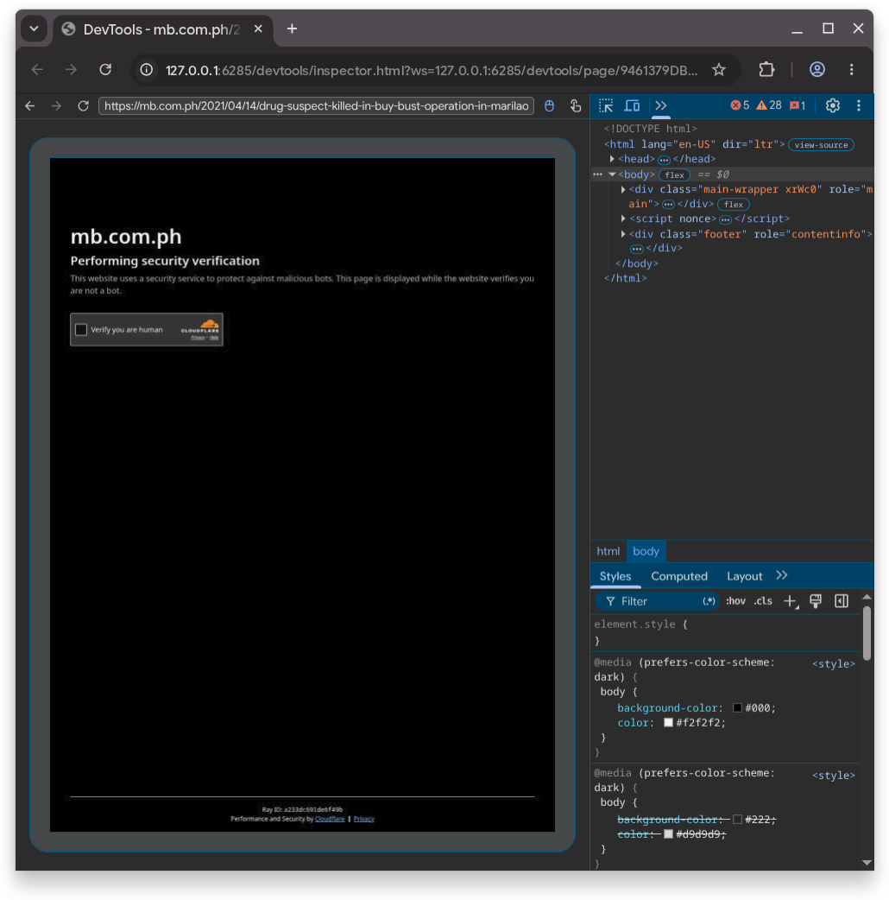
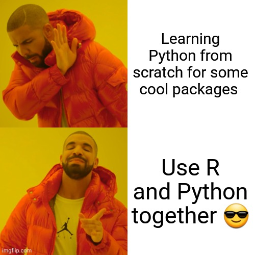
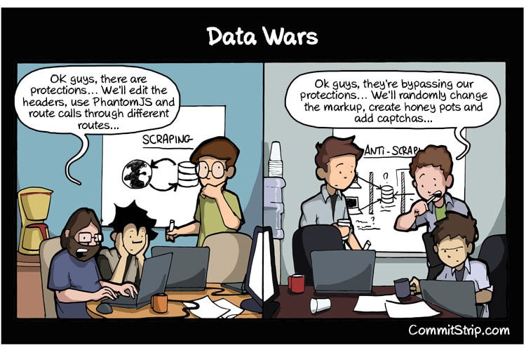

# Browser automation
## What is Browser Automation?

```{r setup}
#| echo: false
#| message: false
library(tidyverse)
library(httr2)
library(rvest)
```

- **Definition**: the process of using software to control web browsers and interact with web elements programmatically
- **Tools Involved**: Common tools include `Selenium`, `Puppeteer`, and `Playwright`
- These tools allow scripts to perform actions like clicking, typing, and navigating through web pages automatically

## Common Uses of Browser Automation

- **Testing**: Widely used in software development for automated testing of web applications to ensure they perform as expected across different environments and browsers
- **Task Automation**: Simplifies repetitive tasks such as form submissions, account setups, or any routine that can be standardized across web interfaces

## Browser Automation in Web Scraping

- **Dynamic Content Handling**: Essential for scraping websites that load content dynamically with JavaScript. Automation tools can interact with the webpage, wait for content to load, and then scrape the data.
- **Simulation of User Interaction**: Can mimic human browsing patterns to interact with elements (like dropdowns, sliders, etc.) that need to be manipulated to access data
- **Avoiding Detection**: More sophisticated than basic scraping scripts, browser automation can help mimic human-like interactions, reducing the risk of being detected and blocked by anti-scraping technologies

# Example: Google Maps
## Goal

:::: {.columns}
::: {.column width="50%"}
1. Check the communte time programatically
2. Extract the distance and time it takes to make a journey
:::
::: {.column width="50%" }
[](https://www.google.de/maps/dir/Armadale+St,+Glasgow,+UK/Lilybank+House,+Glasgow,+UK/@55.8626667,-4.2712892,14z/data=!3m1!4b1!4m14!4m13!1m5!1m1!1s0x48884155c8eadf03:0x8f0f8905398fcf2!2m2!1d-4.2163615!2d55.8616765!1m5!1m1!1s0x488845cddf3cffdb:0x7648f9416130bcd5!2m2!1d-4.2904601!2d55.8740368!3e0?entry=ttu){target="_blank"}
:::
::::

## Can we use `rvest`?

:::: {.columns}

::: {.column width="45%"}
```{r}
static <- read_html(
  "https://www.google.de/maps/dir/Armadale+St,+Glasgow,+UK/Lilybank+House,+Glasgow,+UK/@55.8626667,-4.2712892,14z/data=!3m1!4b1!4m14!4m13!1m5!1m1!1s0x48884155c8eadf03:0x8f0f8905398fcf2!2m2!1d-4.2163615!2d55.8616765!1m5!1m1!1s0x488845cddf3cffdb:0x7648f9416130bcd5!2m2!1d-4.2904601!2d55.8740368!3e0?entry=ttu"
)
static |>
  html_elements(".Fk3sm") |>
  html_text2()
```
:::

::: {.column width="50%" }


:::
::::


## Let's use browser Automation

:::: {.columns}

::: {.column width="45%"}
The new `read_html_live` from `rvest` solves this by emulating a browser:

```{r}
# loads a real web browser
sess <- read_html_live(
  "https://www.google.de/maps/dir/Armadale+St,+Glasgow,+UK/Lilybank+House,+Glasgow,+UK/@55.8626667,-4.2712892,14z/data=!3m1!4b1!4m14!4m13!1m5!1m1!1s0x48884155c8eadf03:0x8f0f8905398fcf2!2m2!1d-4.2163615!2d55.8616765!1m5!1m1!1s0x488845cddf3cffdb:0x7648f9416130bcd5!2m2!1d-4.2904601!2d55.8740368!3e0?entry=ttu"
)
```

You can have a look at the browser with:

```{r}
#| eval: false
sess$view()
```
:::

::: {.column width="50%" }


Unfortunately, we do not get content yet. We first have to click on "Accept all"
:::
::::

## Let's use browser Automation

After manipulating something about the session, you need to read it into `R` again:

```{r}
sess <- read_html_live(
  "https://www.google.de/maps/dir/Armadale+St,+Glasgow,+UK/Lilybank+House,+Glasgow,+UK/@55.8626667,-4.2712892,14z/data=!3m1!4b1!4m14!4m13!1m5!1m1!1s0x48884155c8eadf03:0x8f0f8905398fcf2!2m2!1d-4.2163615!2d55.8616765!1m5!1m1!1s0x488845cddf3cffdb:0x7648f9416130bcd5!2m2!1d-4.2904601!2d55.8740368!3e0?entry=ttu"
)
```

```{r loadcookies}
#| echo: false
# just for rendering, see below for how to save cookies
cookies <- readRDS("data/chromote_cookies.rds")
sess <- sess$session$Network$setCookies(cookies = cookies$cookies)
sess <- read_html_live(
  "https://www.google.de/maps/dir/Armadale+St,+Glasgow,+UK/Lilybank+House,+Glasgow,+UK/@55.8626667,-4.2712892,14z/data=!3m1!4b1!4m14!4m13!1m5!1m1!1s0x48884155c8eadf03:0x8f0f8905398fcf2!2m2!1d-4.2163615!2d55.8616765!1m5!1m1!1s0x488845cddf3cffdb:0x7648f9416130bcd5!2m2!1d-4.2904601!2d55.8740368!3e0?entry=ttu"
)
```

Then we can extract information:

```{r}
# the session behaves like a normal rvest html object
trip <- sess |>
  html_elements("div[data-trip-index]")

trip |>
  html_element("h1") |>
  html_text2()

trip |>
  html_element(".fontHeadlineSmall") |>
  html_text2()

trip |>
  html_element(".fontBodyMedium") |>
  html_text2()
```


## Store the cookies

- Now that we have accepted the cookie banner, a small set of cookies was stored in the browser
- These are destroyed when we close R, however
- We can extract them and save the session for the next run, so no manual intervention is neccesary

```{r}
#| eval: false
cookies <- sess$session$Network$getCookies()
saveRDS(cookies, "data/chromote_cookies.rds")
```

In the next run, you can load the cookies with:

```{r}
#| eval: false
cookies <- readRDS("data/chromote_cookies.rds")
sess <- sess$session$Network$setCookies(cookies = cookies$cookies)
```


# Example: Reddit
## Goal

:::: {.columns}
::: {.column width="50%"}
1. Get Reddit posts
2. Get the timestamp, up/downvot score, post and comment text
:::
::: {.column width="50%" }
[](https://www.reddit.com/r/dataviz/){target="_blank"}
:::
::::

## Can we use `rvest` to get post URLs?

```{r}
html_subreddit <- read_html_live("https://www.reddit.com/r/wallstreetbets/")

posts <- html_subreddit |>
  html_elements("a") |>
  html_attr("href") |>
  str_subset("/comments/") |>
  str_replace_all("^/", "https://www.reddit.com/") |>
  unique()
posts
```

:::{.fragment}
This does not look too bad!
:::

## Can we use `rvest` to get posts?

```{r}
html_post <- read_html_live(
  "https://www.reddit.com/r/wallstreetbets/comments/1ehcsoq/daily_discussion_thread_for_august_01_2024/"
)
post_data <- html_post |>
  html_elements("shreddit-post")

post_data |>
  html_attr("created-timestamp") |>
  lubridate::as_datetime()

post_data |>
  html_attr("id")

post_data |>
  html_attr("subreddit-id")

post_data |>
  html_attr("score")

post_data |>
  html_attr("comment-count")
```

:::{.fragment}
We actually can!
:::

## Can we use `rvest` to get comments?

```{r}
comments <- html_post |>
  html_elements("shreddit-comment")
comments
```

:::{.fragment}
:expressionless:
:::


## Interacting with the session

```{r}
#| eval: false
html_post$view()
```

Scrolling down as far as possible:

```{r}
html_post$scroll_to(top = 10^5)
```

Then clicking the "load_more_comments"-button

```{r}
html_post$click("[noun=\"load_more_comments\"]")
```

This triggers new content to be loaded:

```{r}
comments <- html_post |>
  html_elements("shreddit-comment")
comments
```


# Automate the scrolling

```{r}
#| eval: false
last_y <- -1
#scroll as far as possible
while (html_post$get_scroll_position()$y > last_y) {
  last_y <- html_post$get_scroll_position()$y
  html_post$scroll_to(top = 10^5)
  load_more <- html_post |>
    html_element("[noun=\"load_more_comments\"]") |>
    length()
  if (load_more) {
    html_post$click("[noun=\"load_more_comments\"]")
    html_post$scroll_to(top = 10^5)
  }
  # wati random number of seconds
  sec_random <- runif(1, 1, 3) * 5
  message("Scrolled down, waiting: ", round(sec_random, 1), " s")
  Sys.sleep(sec_random)
}
```


# Example: news with Cloudflare protection
## Goal

:::: {.columns}
::: {.column width="50%"}
1. Collect news media data from Manila Bulletin
:::
::: {.column width="50%" }
[](https://mb.com.ph/2021/04/14/drug-suspect-killed-in-buy-bust-operation-in-marilao/){target="_blank"}
:::
::::

## Initial attempt with `rvest`

```{r}
#| error: true
mb_link <- "https://mb.com.ph/2021/04/14/drug-suspect-killed-in-buy-bust-operation-in-marilao/"
read_html(mb_link)
```

:::{.fragment}
:expressionless:
:::

## Maybe  attempt with `rvest`


:::: {.columns}
::: {.column width="50%"}
```{r}
sess <- read_html_live(mb_link)
```

```{r}
#| eval: false
sess$view()
```
:::{.fragment}
:expressionless:
:::

:::
::: {.column width="50%" }

:::
::::

## Introducing Scrapling


- "An adaptive Web Scraping framework that handles everything from a single request to a full-scale crawl"
- Uses different special versions of a web browsers that can be controlled through code
- Essentially an opinionated collection of other packages for automation tasks: 
  - Can adapt it's own code to look for elements (if you scrape continuously)
  - Simplifies continuous crawling
  - Can impersonate other browsers
  - Can request and collect raw data stealthyly
- kept up to date with the newest tricks in the "data war"
  
  
:::{.fragment}
But wait, that's a Python package!
:::

## Introducing `reticulate`

:::: {.columns}

::: {.column width="60%"}
- `reticulate` provides an easy interface to use Python functions and packages
- converts almost all objects with ease from Python to R (and the other way around)
- you get the best of both worlds:
  - bleeding edge software from the software engineering community
  - familiar and intuitive world class packages for statistics, data science, visualization etc.
- No need to choose between Python and R anmore, you can just use both in the same session
:::

::: {.column width="40%" }


:::

::::


## Install and import

```{r}
library(reticulate)
py_require(c(
  "scrapling",
  "curl_cffi",
  "playwright",
  "patchright",
  "msgspec",
  "browserforge"
))
scrapling <- import("scrapling")
```

## Try the page

```{r}
#| eval: false
page <- scrapling$fetchers$StealthyFetcher$fetch(
  mb_link,
  headless = FALSE,
  network_idle = TRUE
)
```

```{r}
# echo: false
page <- scrapling$fetchers$StealthyFetcher$fetch(
  mb_link,
  headless = TRUE,
  network_idle = TRUE
)
```

Looks good :relieved: :magic_wand:!

## Getting the content

```{r}
html <- page$body |>
  as.character() |>
  read_html()

html |>
  html_text() |>
  stringr::str_detect("Drug suspect")

headline <- html |>
  html_elements(".article-title") |>
  html_text2()

author <- html |>
  html_elements(".author-section a") |>
  html_text2()

date <- html |>
  html_elements(".issue_date") |>
  html_text2() |>
  stringr::str_extract("\\w{3} \\d{1,2}, \\d{4}") |>
  lubridate::mdy()


text <- html |>
  html_elements(".article-full-body p") |>
  html_text2() |>
  paste0(collapse = "\n\n")

tibble::tibble(
  url = mb_link,
  date,
  author,
  headline,
  text
)
```


## Mission: success!


# Summary: Browser Automation
## What is it

- remote control a browser to perform pre-defined steps
- several available tools: 
  - native `R`: `chromote`, used in `read_html_live`
  - native `Python`: `Playwright`, can be used from `R` with `playwrightr` (experimental)
  - native `Java`: `Selenium`, can be used from `R` with  `RSelenium` (buggy and outdated)
  - native `JavaScript`: `Puppeteer` not `R` bindings
- Opinionated tool collections:
  - `scrapling`: combines different tools for "stealthy" scraping

## What are they good for?


:::: {.columns}
::: {.column width="60%"}
- Get content from pages which you can't otherwise access
- Load more content through automated scrolling on dynamic pages
- Automate tasks like downloading files
:::
::: {.column width="40%" }

:::

::::

## Issues

:::: {.columns}

::: {.column width="40%" .incremental}
- Companies have mechanisms to counter scraping:
  - rate limiting requests per second/minute/day and user/IP(Twitter)
  - captchas (can be solved but quite complex)
- Won't get you around very obscure HTML code (Facebook)
- Quite heavy and very slow compared to requests
:::

::: {.column width="60%"}

:::
::::


# Wrap Up

Save some information about the session for reproducibility.

```{r}
sessionInfo()
```
